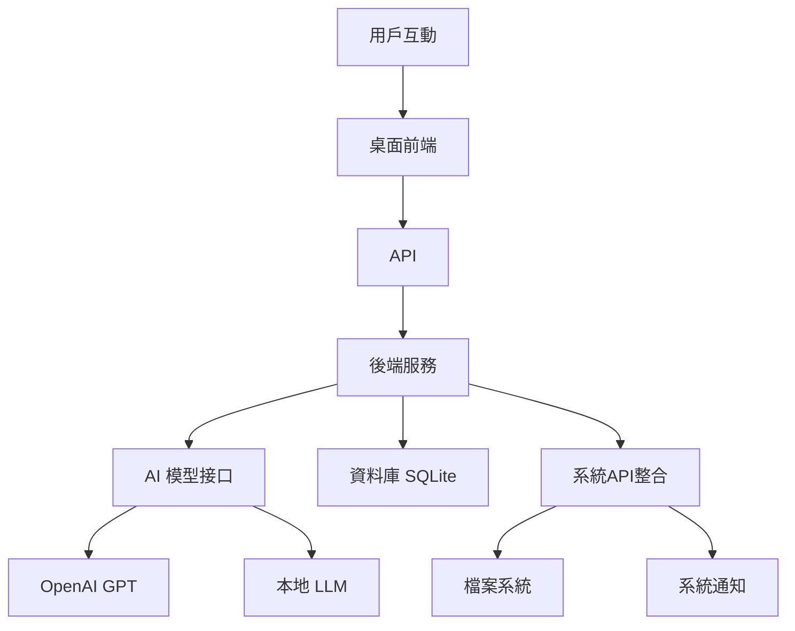

# Desktop Pet

## 智能桌面寵物 - 專題報告

  
    個人助理的未來形態
  

---
layout: center
class: text-center
---

# 專案概述

## 🎯 專案目標
- 打造智能桌面夥伴
- 提供個人化助理服務
- 結合AI與可愛外觀
- 增強使用者體驗

## 🛠️ 技術棧
- **前端**: Svelte + Tauri
- **後端**: Python FastAPI
- **AI**: OpenAI GPT / 本地模型
- **桌面**: 跨平台原生應用

---
class: flex justify-center items-center
---

  又是桌面助理?

  <v-clicks>
    

      <h1 flex items-center text="5xl!">
        這不是很常見的嗎?
      </h1>
    

  </v-clicks>

---
class: flex justify-center items-center
---

  
  
  
  

---
class: flex justify-center items-center
---

  那為何還要做?

  <v-clicks>
    

      <h1 flex items-center text="5xl!">
        使用別人做的老婆 不就是NTR嗎?
      </h1>
    

  </v-clicks>

---
layout: center
class: text-center
---

# 系統架構

---
layout: center
class: space-2
---

# 開發挑戰

<v-clicks>

  

    

      記憶系統
    

  

  

    

      
        作為一個仿生智能助理，記憶系統不只是 RAG 就好
      
    

    

        
就像人類會在晚上整理記憶

        
ai也需要整理記憶 刪除不需要的資料

    

  

  

    

      情緒模擬
    

  

  

    

      
        真實的情緒反應不僅僅是預設回應，需要基於上下文和記憶進行動態情緒計算
      
    

    

      
情緒狀態的持續性和變化

      
多維度情緒向量計算

      
情緒與記憶的雙向影響

    

  

  

    

      資料抓取
    

  

  

    

      
        桌面寵物(老婆)需要主動感知用戶的操作環境，而不是被動等待輸入
      
    

    

      
跨應用程式的資料收集

      
隱私保護下的環境感知

      
即時資料處理與分析

    

  

</v-clicks>

---
layout: image-right
image: image.png

---

## 休比 Üc207Pr4f57t9
開發計畫

- **Alles-Lösen** 用戶資訊收集器
- **Sisters**  MAS系統

"想要了解『心』是什麼..." - 休比

---
layout: end
class: text-center
---

# 謝謝聆聽

## Desktop Pet - 智能桌面寵物

  

    專題報告 | 2025
  

