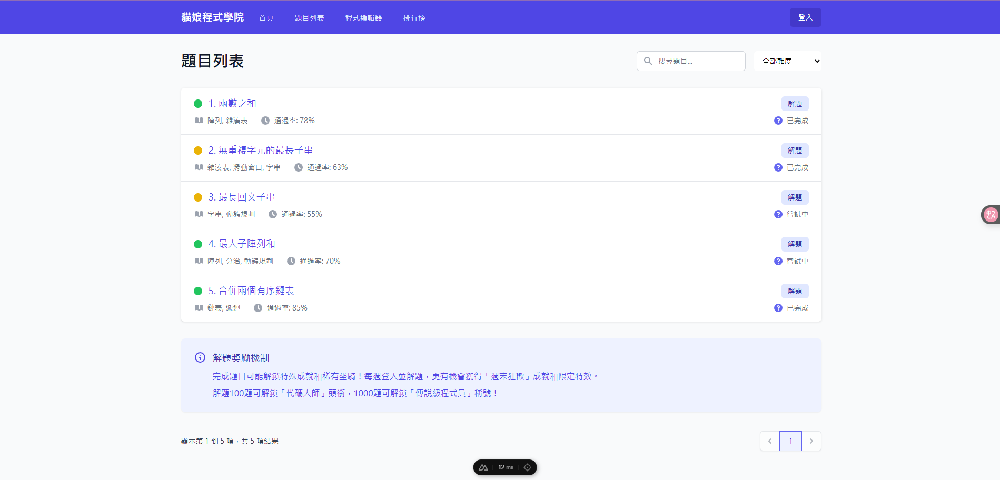

# Share-cat 開發進度報告

## 程式學習平台

  <a href="https://github.com/share-cat" target="_blank" alt="GitHub" title="Open in GitHub"
    class="text-xl slidev-icon-btn opacity-50 !border-none !hover:text-white">
    <carbon-logo-github />
  </a>

---

# 專案概述

- **專案名稱**: Share-cat
- **前端**: Nuxt.js
- **後端**: Golang
- **AI**: python
- **目標**: 提供互動式程式學習體驗
- **特色**:
    - 程式練習與挑戰
    - 社群互動
    - AI 輔助學習

---

# 首頁設計

- 簡潔現代的UI設計
- 清晰的功能導航

---

# 題目系統

## 題目類型

- 演算法挑戰
- 數據庫操作

## 難度分級

- 簡單 (綠色標記)
- 中等 (黃色標記)
- 困難 (紅色標記)

---

# 解題獎勵機制

完成題目可獲解題徽章與積分

## 獎勵類型

- 徽章
- 頭銜解鎖
- 稀有特效

## 獎勵獲取方式

- 完成挑戰任務
- 效率排名靠前
- 持續學習打卡
- 參與社群貢獻

---

# 開發計劃

  <h3>正在進行</h3>
  <ul>
    <li>代碼運行安全容器</li>
    <li>後端開發</li>
    <li>前端開發</li>
  </ul>

---

# 謝謝聆聽
