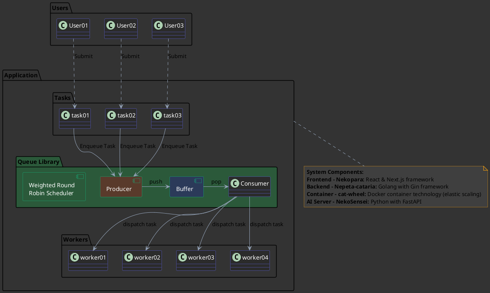

# SHARE-CAT

現代化的線上解題系統

B11123213 戚雲飛 
B11123220 賴瑞宸 
B11323213 黃宥睿

---

# 目錄

  
1. 專案背景與動機

  
2. 系統功能介紹

  
3. 技術架構

  
4. AI 整合功能

  
5. 未來發展方向

---

# 專案背景與動機

現代程式教育面臨的挑戰：

  

    
學習資源分散

    
學生需要在不同平台間切換，降低學習效率

  

  

    
缺乏即時反饋

    
傳統平台難以提供個性化的程式學習指導

  

  

    
教師負擔重

    
題目設計與評分耗時

  

  

    
技術快速發展

    
現有平台難以完成特殊題型

  

SHARE-CAT 致力於解決這些問題，打造一站式的現代化程式學習平台。

---

# 什麼是 Share-cat？

Share-cat 是 PLWeb 的升級版，是一個整合多功能的 Online Judge 系統。

  

    
四大核心功能

    

      

🏆
 
競程平台 - 支援各類競賽模式與即時排名

      

📝
 
考試平台 - 自動評分與防作弊機制

      

🚩
 
CTF 平台 - 資安技能與實戰演練

      

📚
 
學習平台 - 互動式教學與進度追蹤

    

  

  

    
與 PLWeb 的差異

    

      

        
✓

        
現代化 UI/UX 設計，更直覺的操作體驗

      

      

        
✓

        
更強大的程式語言支援與評測系統

      

      

        
✓

        
整合 AI 輔助功能，提高教學與學習效率

      

      

        
✓

        
最新技術崁，擴展性更佳，支援大規模用戶

      

    

  

---

# Share-cat 可以做到什麼？

  

    
學生視角

    

      

        
💻

        
參與各種程式設計競賽與挑戰

      

      

        
🧩

        
通過AI互動幫助釐清問題

      

      

        
📊

        
追蹤個人學習進度與能力成長

      

      

        
👥

        
與同儕交流解題思路，共同成長

      

    

  

  

    
教師視角

    

      

        
📝

        
輕鬆建立測驗與競賽，自動評分

      

      

        
📈

        
分析學生表現數據，掌握學習狀況

      

      

        
🤖

        
利用 AI 協助生成題目與測試案例

      

    

  

  
未來展望

  

    支援 AI 模型競賽、程式碼智能分析、學生論壇等
  

---

# Share-cat 預計可以支援哪些語言？

  

    
<logos-python />

    
Python 3

  

  

    
<logos-java />

    
Java

  

  

    
<logos-php />

    
PHP

  

  

    
<logos-c />

    
C

  

  

    
<logos-c-plusplus />

    
C++

  

  

    

      <logos-javascript />
    

    
JavaScript

  

  

    

      <logos-rust />
    

    
Rust

  

more...

---

# AI 功能

  

    
教師端 AI 功能

    

      
🤖 題目生成

      
根據課程要求，自動生成符合教學目標的題目

    

    

      
📊 學習數據分析

      
分析學生解題模式與錯誤類型

    

    

      
🧪 測試案例生成

      
自動生成測試案例，確保題目評測的準確性

    

  

  

    
學生端 AI 功能

    

      
💡 智能提示

      
提供針對性的解題提示，不直接給出答案，而是引導思考方向

    

    

      
💬 程式碼對話助手

      
回答關於程式概念的問題，解釋錯誤原因，建議優化方向

    

  

AI 功能設計原則：輔助而非取代學習過程，強調培養解題思路與程式設計能力

---

# 專案架構

  

    

      
前端 - Nekopara

      
• React & Next.js 

      
• 現代化的UI介面

      
• 線上編輯器

      
🖥️

    

    

      
後端 - Nepeta-cataria

      
• Golang 搭配 Gin 框架

      
• RESTful API 設計

      
• 高效能

      
⚙️

    

  

  

    

      
容器 - cat-wheel

      
• 隔離的程式執行環境

      
• linux 容器技術

      
• 安全的程式碼評測機制

      
📦

    

    

      
AI Server - NekoSensei

      
• Python 搭配 FastAPI

      
• 整合大型語言模型

      
• 程式碼分析與生成能力

      
🤖

    

  

---

---

# 系統部署與未來計劃

  

    
開發進度

    

      

        

        
前端框架 - 開發中

      

      

        

        
後端 API - 開發中

      

      

        

        
AI 系統 - 開發中

      

      

        

        
容器系統 - 規劃中

      

    

  

  

    
未來發展方向

    

      

        
●

        
多語言

      

      

        
●

        
社群功能

      

      

        
●

        
插件系統

      

    

  

  
預計發布時間表

  
預計在這個學期完成MVP版本

---

# 謝謝

有任何問題歡迎提問

簡報製作: 白雲

